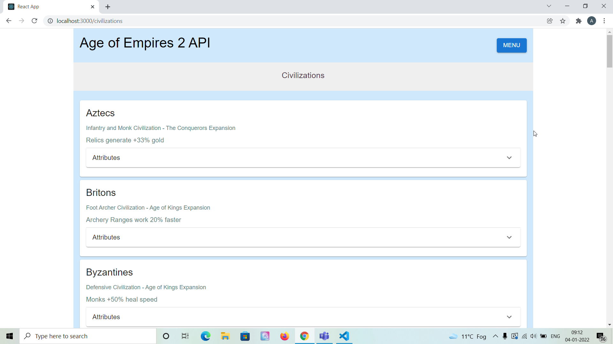

# Age of Empires 2 - Web application with API integration ⚡️

## Project Briefing

This is a simple database application which integrates with Age of Empires 2 API and lists various entities available in the game like units, civilizations, structures and technologies.

Made with ❤️ by **[@apfirebolt](https://github.com/Apfirebolt/)**

Please find me [here](https://apgiiit.com/)
## Features

- Demonstrates use of Context API in React.
- Demonstrates use of beautiful Material UI React Components like cards, buttons, accordions and more.
- Contains use of updated React Router packages.

## Built With

* [React](https://reactjs.org/)
* [Context API](https://reactjs.org/docs/context.html)
* [Material UI React](https://mui.com/)

## Project setup

Simply install node modules for the React app and you're done at least for the development mode.

```
npm install
npm start
```

For production, build the frontend of the app. 

```
npm run build
npm start
```

## Future Updates

Deployment scripts to be added through Docker, Heroku and Netlify.

## Project Screenshots

Please find some of the screenshots of the application. Below is the screenshot of the Homepage.


Civilizations page, this page lists all the civilizations available in the game.



Structures page, this page lists all the structures available in the game.


Technologies page, this page lists all the technologies available in the game.


